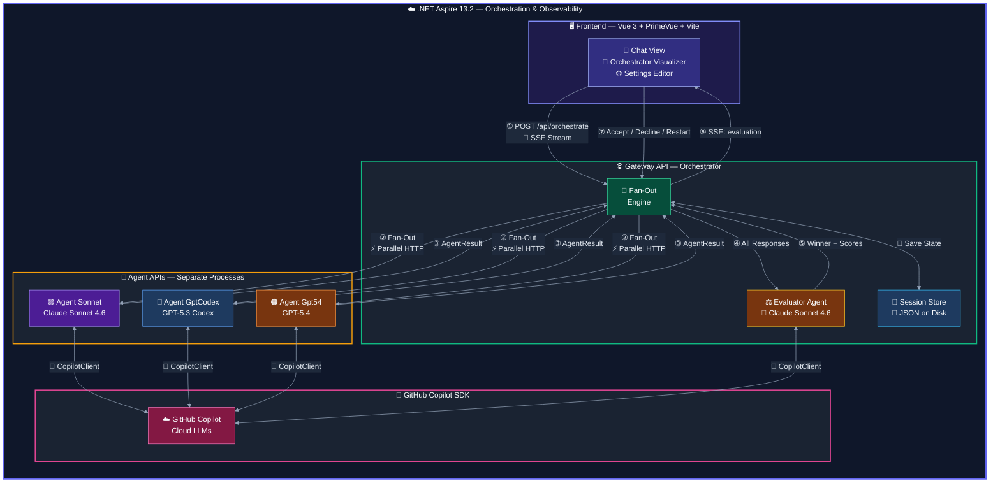
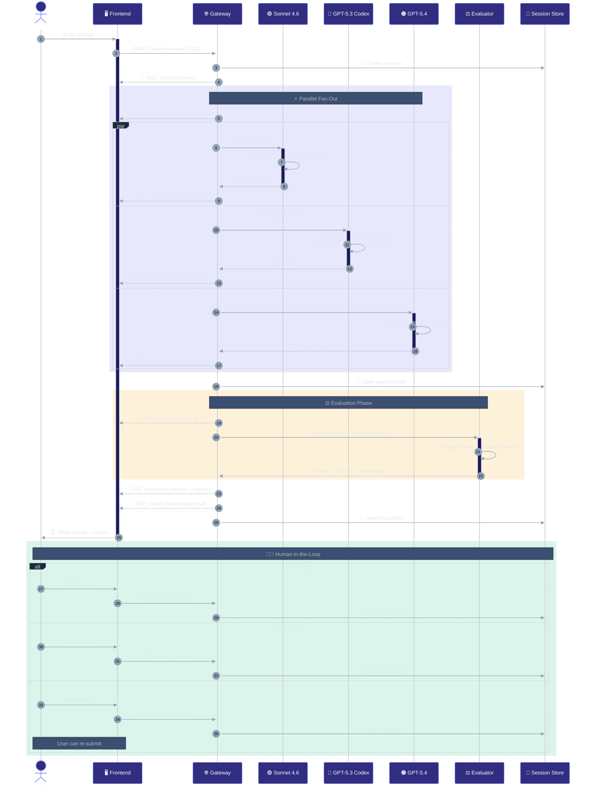
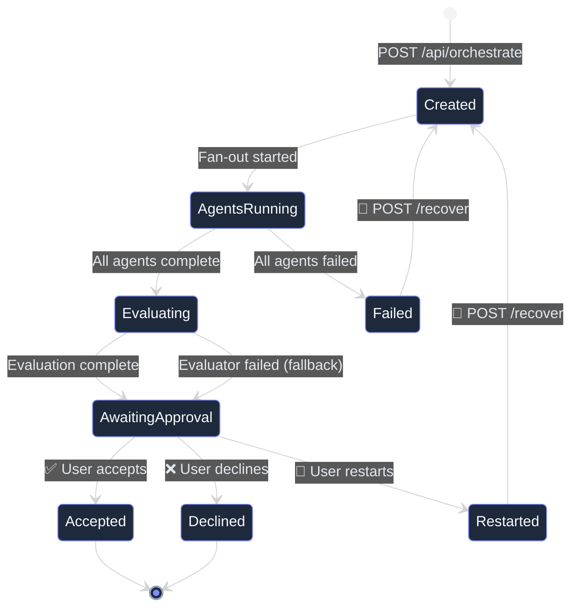

# 🤖 Agentic Workflow

> **A distributed multi-agent AI orchestration system** — fan-out a prompt to three LLM agents, evaluate responses with a dedicated evaluator agent, and present the winner to a human for approval — all streaming in real-time.

Built with **.NET 10**, **Aspire 13.2**, **Microsoft Agent Framework**, **GitHub Copilot SDK**, and a **Vue 3 + PrimeVue** frontend.

---

## ✨ Key Features

| Feature | Description |
|---------|-------------|
| 🔀 **Fan-Out** | Single prompt dispatched in parallel to 3 independent agent APIs |
| 🧠 **Multi-Model** | Each agent uses a different LLM: **Claude Sonnet 4.6**, **GPT-5.3 Codex**, **GPT-5.4** |
| ⚖️ **Evaluator Agent** | A 4th agent (Sonnet 4.6) scores all responses on accuracy, completeness, clarity, and relevance |
| 🧑‍⚖️ **Human-in-the-Loop** | User reviews the winner and can **accept**, **decline**, or **restart** |
| 📡 **Real-Time SSE** | Gateway streams status, agent completions, and evaluation to the frontend as Server-Sent Events |
| 💾 **Session Persistence** | Every session state transition is saved to disk as JSON with structured logging |
| 🔭 **Aspire Dashboard** | Distributed tracing, metrics, and health checks across all services out of the box |
| 🎨 **Dark Glassmorphism UI** | Animated SVG orchestration visualizer with live agent status and winner highlights |
| 🧩 **Safe Code Highlighting** | Shared markdown renderer with bounded syntax-highlighting work to keep large responses responsive |
| ✏️ **Editable Prompts** | Driving system prompt, per-agent overrides, and evaluator prompt — all editable in the Settings page |

---

## 🏗️ Architecture



---

## 🔄 Orchestration Flow



---

## 📁 Solution Structure

```
agentic-workflow/
├── 📄 README.md
├── 📄 CHANGELOG.md
├── 📄 research.md                        # MS Agent Framework research
├── 📁 sessions/                           # JSON session files (git-ignored)
└── 📁 src/
    ├── 📄 AgenticWorkflow.sln
    │
    ├── 📁 AgenticWorkflow.AppHost/        # ☁️  Aspire 13.2 orchestrator
    │   └── Program.cs                     #     Registers all services + frontend
    │
    ├── 📁 AgenticWorkflow.ServiceDefaults/# 🔧 Aspire defaults
    │   └── Extensions.cs                  #     OpenTelemetry, health checks, resilience
    │
    ├── 📁 AgenticWorkflow.Shared/         # 📦 Shared library
    │   ├── Models/
    │   │   ├── AgentRequest.cs            #     Fan-out request DTO
    │   │   ├── AgentResult.cs             #     Agent response DTO
    │   │   ├── EvaluationResult.cs        #     Evaluator output with scores
    │   │   ├── SessionState.cs            #     Full session lifecycle model
    │   │   ├── PromptConfig.cs            #     Editable system prompts
    │   │   └── StreamEvent.cs             #     SSE event envelope
    │   └── Services/
    │       ├── ISessionStore.cs           #     Session CRUD interface
    │       ├── JsonFileSessionStore.cs    #     File-based persistence + locking
    │       ├── IPromptConfigStore.cs      #     Prompt config interface
    │       └── JsonFilePromptConfigStore.cs
    │
    ├── 📁 AgenticWorkflow.Gateway/        # 🌐 Orchestrator API
    │   └── Program.cs                     #     Fan-out, evaluation, SSE, decisions
    │
    ├── 📁 AgenticWorkflow.Agent.Sonnet/   # 🟣 Claude Sonnet 4.6
    │   ├── Program.cs                     #     /api/run + /api/run-stream
    │   └── appsettings.json               #     Model + system prompt config
    │
    ├── 📁 AgenticWorkflow.Agent.GptCodex/ # 🔵 GPT-5.3 Codex
    │   ├── Program.cs
    │   └── appsettings.json
    │
    ├── 📁 AgenticWorkflow.Agent.Gpt54/    # 🟠 GPT-5.4
    │   ├── Program.cs
    │   └── appsettings.json
    │
    └── 📁 AgenticWorkflow.Frontend/       # 🖥️  Vue 3 + PrimeVue + Vite
        ├── package.json
        ├── vite.config.ts
        └── src/
            ├── main.ts
            ├── App.vue
            ├── style.css                  #     Dark glassmorphism theme
            ├── types/index.ts
            ├── composables/
            │   └── useOrchestrator.ts     #     SSE client + reactive state
            ├── views/
            │   ├── ChatView.vue           #     Main chat interface
            │   └── SettingsView.vue       #     Prompt editor
            └── components/
                ├── OrchestratorVisualizer.vue  # Animated SVG pipeline
                └── ChatBubble.vue              # Role-styled messages
```

---

## 🏁 Getting Started

### Prerequisites

- [.NET 10 SDK](https://dotnet.microsoft.com/download/dotnet/10.0)
- [Node.js 20+](https://nodejs.org/) (for the Vue frontend)
- [GitHub Copilot subscription](https://github.com/features/copilot) (Business or Enterprise)
- Authenticated via `gh auth login` or `GITHUB_TOKEN` environment variable

### Run

```bash
# 1. Clone
git clone <repo-url> && cd agentic-workflow

# 2. Install frontend dependencies
cd src/AgenticWorkflow.Frontend && npm install && cd ../..

# 3. Launch via Aspire
cd src/AgenticWorkflow.AppHost
dotnet run
```

The Aspire dashboard opens automatically — typically at `https://localhost:17145`. From there you can access:

| Service | Description |
|---------|-------------|
| **Frontend** | Vue chat UI + settings |
| **Gateway** | Orchestration API |
| **Agent-Sonnet** | Claude Sonnet 4.6 agent |
| **Agent-Codex** | GPT-5.3 Codex agent |
| **Agent-Gpt54** | GPT-5.4 agent |

---

## 🔌 API Reference

### Gateway Endpoints

| Method | Endpoint | Description |
|--------|----------|-------------|
| `POST` | `/api/orchestrate` | Start orchestration (returns SSE stream) |
| `GET` | `/api/sessions` | List all sessions |
| `GET` | `/api/sessions/{id}` | Get session by ID |
| `POST` | `/api/sessions/{id}/decide` | Submit decision: `accept`, `decline`, `restart` |
| `POST` | `/api/sessions/{id}/recover` | Retry a failed/restarted session |
| `GET` | `/api/config/prompt` | Get prompt configuration |
| `PUT` | `/api/config/prompt` | Update prompt configuration |

### Agent Endpoints (per agent)

| Method | Endpoint | Description |
|--------|----------|-------------|
| `POST` | `/api/run` | Synchronous completion (used by Gateway fan-out) |
| `GET` | `/api/run-stream` | SSE streaming completion |

### SSE Event Types

```jsonc
// Status update
{ "type": "status", "sessionId": "...", "status": "AgentsRunning", "content": "Agents running" }

// Agent completed
{ "type": "agent_complete", "sessionId": "...", "agentName": "Agent-Sonnet", "agentResult": { ... } }

// Evaluation result
{ "type": "evaluation", "sessionId": "...", "evaluation": { "winner": "Agent-Gpt54", "scores": { ... } } }

// Error
{ "type": "error", "sessionId": "...", "content": "Agent agent-codex failed: ..." }
```

---

## ⚖️ Evaluator

The evaluator agent uses **Claude Sonnet 4.6** via the GitHub Copilot SDK. It receives all agent responses and the original prompt, then scores each on four dimensions:

| Dimension | Scale | Description |
|-----------|-------|-------------|
| **Accuracy** | 1–10 | Factual correctness |
| **Completeness** | 1–10 | Thoroughness of coverage |
| **Clarity** | 1–10 | Coherence and readability |
| **Relevance** | 1–10 | Alignment with the original prompt |

The default evaluator prompt is editable in the **Settings** page. If the evaluator fails, a fallback heuristic selects the longest successful response.

---

## 💾 Session Persistence

Sessions are stored as individual JSON files in the `sessions/` directory:

```
sessions/
├── abc123.json
├── def456.json
└── prompt-config.json
```

Each session file captures the full lifecycle:

```jsonc
{
  "id": "abc123",
  "prompt": "Explain quantum computing",
  "systemPrompt": "You are a helpful assistant.",
  "status": "Accepted",           // Created → AgentsRunning → Evaluating → AwaitingApproval → Accepted
  "agentResults": [ /* 3 results */ ],
  "evaluation": { "winner": "Agent-Gpt54", "scores": { ... } },
  "chatHistory": [ /* user, agent, evaluator, system messages */ ],
  "createdAt": "2025-07-17T10:00:00Z",
  "updatedAt": "2025-07-17T10:00:15Z"
}
```

**Safety features:**
- Path traversal prevention (session IDs sanitised to alphanumeric + hyphens)
- Per-session `SemaphoreSlim` file locking (no concurrent write corruption)
- All state transitions logged with session ID and timestamp

---

## 🛡️ Session Status State Machine



---

## 🧰 Tech Stack

| Layer | Technology | Version |
|-------|-----------|---------|
| **Runtime** | .NET | 10.0 |
| **Orchestration** | Aspire | 13.2.0 |
| **Agent Framework** | Microsoft.Agents.AI.GitHub.Copilot | 1.0.0-preview.260311.1 |
| **LLM SDK** | GitHub.Copilot.SDK | 0.2.1-preview.1 |
| **Frontend** | Vue 3 + TypeScript | 3.5 |
| **UI Library** | PrimeVue (Aura Dark) | 4.5 |
| **Bundler** | Vite | 8.x |
| **Observability** | OpenTelemetry (via Aspire) | Built-in |
| **Persistence** | JSON files on disk | — |

---

## 🎨 Frontend Screenshots

The frontend features a **dark glassmorphism** design with:

- **Chat View** — Message bubbles colour-coded by role (user, agent, evaluator, system)
- **Orchestrator Visualizer** — Animated SVG showing the pipeline state in real-time:
  - 🔘 Grey = idle | 🔵 Blue pulse = running | 🟢 Green = complete | 🔴 Red = failed | 🟡 Gold = winner
- **Settings View** — Full prompt editor for driving prompt, evaluator prompt, and per-agent overrides
- **Approval Bar** — Accept ✅ / Decline ❌ / Restart 🔄 buttons appear after evaluation

---

## 📝 Configuration

### Agent Configuration (`appsettings.json`)

Each agent reads its model and system prompt from configuration:

```json
{
  "Agent": {
    "Name": "Agent-Sonnet",
    "Model": "claude-sonnet-4.6",
    "SystemPrompt": "You are a helpful assistant. Provide thorough, well-reasoned responses."
  }
}
```

### Prompt Configuration (Runtime — via Settings UI)

The driving system prompt, evaluator prompt, and per-agent overrides are stored in `sessions/prompt-config.json` and editable through the Settings page at runtime.

---

## 🚧 Known Limitations

- **CORS** is `AllowAnyOrigin()` — suitable for development only
- **No authentication** — add auth middleware before production use
- **No CI/CD pipeline** — tests, scanning, and release automation are not yet configured
- **Evaluator model** is hardcoded to `claude-sonnet-4.6` — make configurable if needed
- **SemaphoreSlim** per-session in the session store is never evicted (unbounded for long-running instances)

### Resilience & Timeouts

The Gateway's HTTP clients for agent APIs use a **custom Polly resilience handler** (overriding Aspire's default 10s/30s timeouts) because LLM calls can take minutes:

| Setting | Value | Reason |
|---------|-------|--------|
| Total request timeout | 5 min | LLM generation can be slow |
| Per-attempt timeout | 5 min | Same — no early kill |
| Max retries | 1 | Retry once on transient failure |
| Circuit breaker sampling | 10 min | Avoid false-tripping on slow calls |

---

## 📄 Licence

Private — not yet published.
